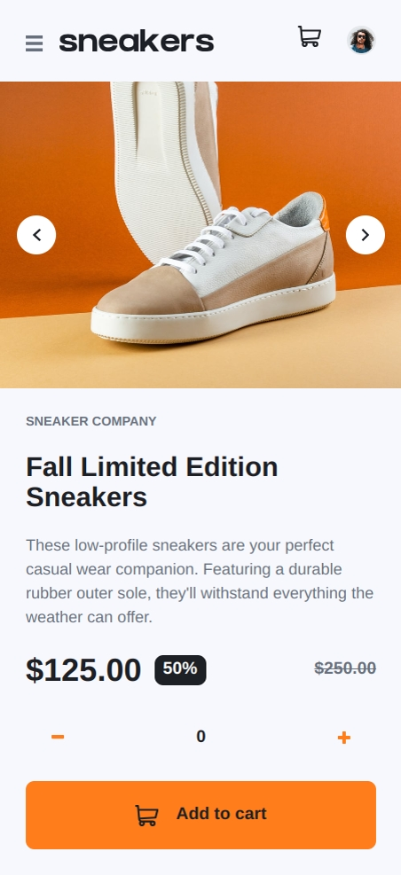
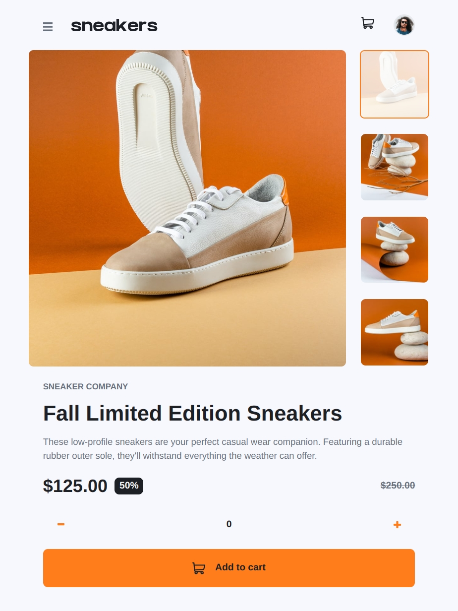
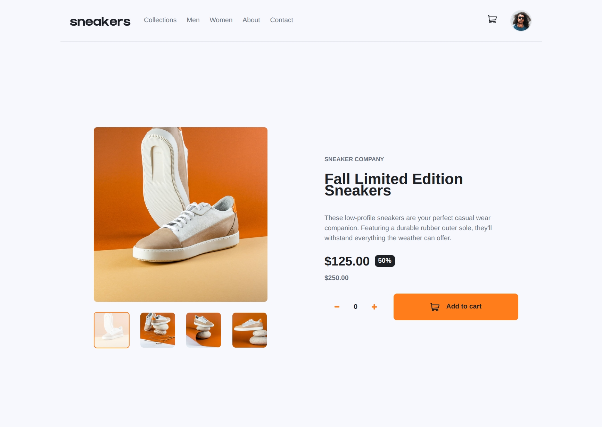

# Frontend Mentor - E-commerce product page solution

This is a solution to the [E-commerce product page challenge on Frontend Mentor](https://www.frontendmentor.io/challenges/ecommerce-product-page-UPsZ9MJp6). Frontend Mentor challenges help you improve your coding skills by building realistic projects.

## Table of contents

- [Frontend Mentor - E-commerce product page solution](#frontend-mentor---e-commerce-product-page-solution)
  - [Table of contents](#table-of-contents)
  - [Overview](#overview)
    - [The challenge](#the-challenge)
    - [Screenshot](#screenshot)
    - [Links](#links)
  - [My process](#my-process)
    - [Built with](#built-with)
    - [What I learned](#what-i-learned)
    - [Continued development](#continued-development)
  - [Author](#author)

## Overview

### The challenge

Users should be able to:

- View the optimal layout for the site depending on their device's screen size
- See hover states for all interactive elements on the page
- Open a lightbox gallery by clicking on the large product image
- Switch the large product image by clicking on the small thumbnail images
- Add items to the cart
- View the cart and remove items from it

### Screenshot





### Links

- Solution URL: [GitHub](https://github.com/adamskiee-frontendmentor-projects/ecommerce-product-page)
- Live Site URL: [Live Site URL](https://adamskiee-frontendmentor-projects.github.io/ecommerce-product-page/)

## My process

### Built with

- Semantic HTML5 markup
- CSS custom properties
- Flexbox
- CSS Grid
- Mobile-first workflow
- [Tailwind](https://tailwindcss.com) - CSS Framework
- [Fluid Tailwind](hhttps://fluid.tw/) - For responsive design

### What I learned

- Working with popover

```css
.cart-popover {
    @apply desktop:relative;
}
.cart-btn {
  @apply relative flex-grow outline-none rounded-full;
}
.cart-body {
  @apply fixed z-30 bg-white left-2 right-2 top-20 text-left rounded-lg flex flex-col shadow-lg tablet:left-20 tablet:right-20 desktop:absolute desktop:w-96 desktop:top-10 desktop:left-1/2 desktop:-translate-x-1/2 desktop:-right-8;
}
```

- Working with overlay

```html
<div class="image-container">
  
  <div class="overlay" aria-hidden="false">
    <button class="previous-btn img-btn" id="previous-img-btn">
      
    </button>
    <button class="next-btn img-btn" id="next-img-btn">
      
    </button>
  </div>
</div>
```

```css
.overlay {
  @apply absolute inset-0 flex items-center justify-between px-4 pointer-events-none;
}
.overlay > * {
  @apply pointer-events-auto;
}
```

- Working with lightbox

```html
<dialog class="lightbox-dialog" aria-modal="true" id="lightbox-dialog">
  <div class="lightbox-content" aria-live="polite">
    <!-- Existing code -->
  </div>
</dialog>
```

```css
.lightbox-dialog[open] {
  @apply fixed inset-0 flex items-center justify-center max-w-xl bg-transparent overflow-visible h-full;
}
.lightbox-content {
  @apply h-full flex flex-col gap-4 items-end justify-center;
}
```

- Working with transform

```css
.desktop-menu .nav-link::before {
  content: "";
  position: absolute;
  width: 100%;
  height: 4px;
  background: orange;
  top: 320%;
  transform: scaleX(0);
  transform-origin: center;
  transition: transform 0.5s;
}
.desktop-menu .nav-link:hover::before,
.desktop-menu .nav-link:focus::before {
  transform: scaleX(1);
  transform-origin: center;
}
```

### Continued development

- I want to learn what are the ways to reuse the code especially working with images and menus.
- I want to styles components especialy those that I not encountered.

## Author

- Frontend Mentor - [@Adamskiee](https://www.frontendmentor.io/profile/yourusername)
